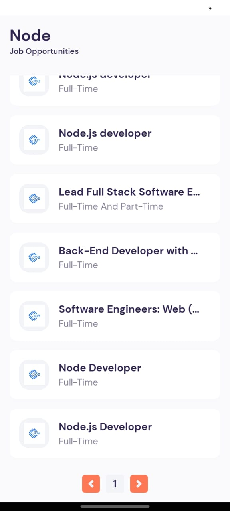
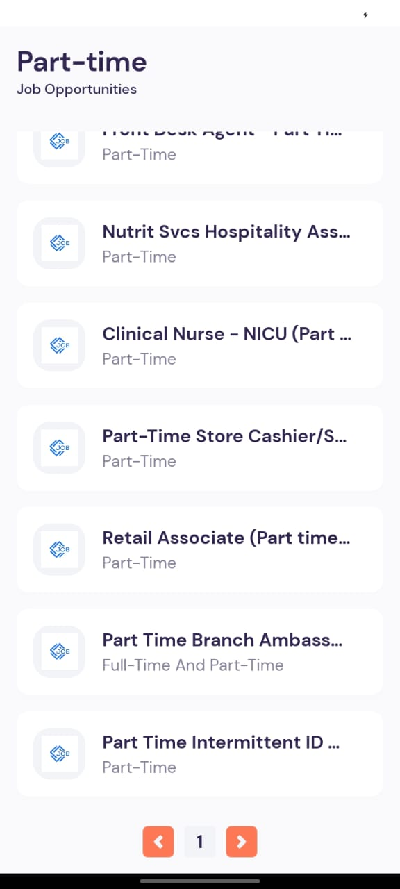

# JSearch-Mobile-App

## Version
0.1.0

## Introduction

Welcome to **JSearch-Mobile-App**, a job search platform developed using React Native with Expo. This application leverages the JSearch API to provide users with a streamlined way to explore job opportunities. Users can search for jobs, view detailed job descriptions, and apply to relevant positions. The app categorizes jobs into tabs for Full-Time, Part-Time, and Contract-based roles, while the home page highlights recent and popular job vacancies.

### Features

#### User Features
- **Job Search:** Search for jobs by keywords and titles.
- **Job Details:** View detailed job descriptions, including qualifications, responsibilities, and company information.
- **Apply for Jobs:** Easily apply to jobs from within the app.
- **Job Categories:** Explore jobs categorized as Full-Time, Part-Time, and Contract-based via dedicated tabs.
- **Home Page Highlights:** View recent and popular job vacancies for quick navigation.

### Preview

#### Screenshots

  
  
  
  
  

### Technologies Used

#### Frontend

- **Framework:** React Native with Expo
- **State Management:** React Context API
- **Data Fetching State Management:** React Query
- **HTTP Client:** Axios
- **Navigation:** React Navigation
- **Toast Notifications:** React Native Toastify

#### Backend

The application communicates with the **JSearch API Service**, which provides endpoints for job searches, job details, and application submissions.

## Usage Disclaimer

This project is designed for educational purposes and is not intended for commercial use. The app and all associated assets are used solely for demonstration and learning.

## License

Copyright &copy; 2024 [Your Name]. All Rights Reserved 
This project is licensed under the [MIT License](LICENSE.txt).
